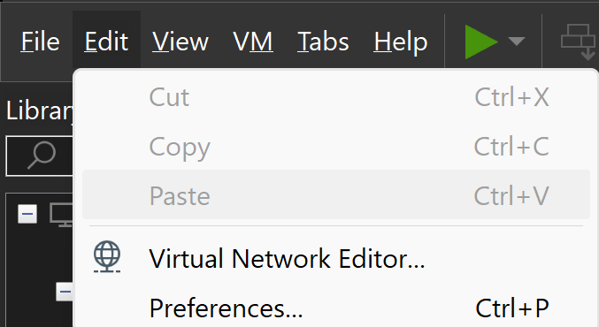

# Hướng Dẫn Cài Đặt Cụm Kubernetes (K8s)

## Lưu ý
### Cần kiểm tra dải địa chỉ IP hợp lệ và Gateway IP trước khi thiết lập địa chỉ IP cho các server để đảm bảo kết nối được với Internet

### Trên VMware Workstation, chọn Edit -> Virtual Network Editor



### Lựa chọn loại mạng NAT, chọn DHCP Settings. Khi đó dải địa chỉ hợp lệ sẽ hiện ra


### Kiểm tra Gateway IP: Chọn NAT Settings -> Xuất hiện các thông tin về SubnetIP, Subnet mask và GatewayIP


## 1. Chuẩn Bị Hệ Thống

### Các thông số của từng node

| Hostname      | OS            | IP              | RAM  | CPU |
|--------------|--------------|----------------|----------------|----------------|
| k8s-master-1 | Ubuntu 22.04 | 192.168.164.201  | 8 GB             | 2              |
| k8s-master-2 | Ubuntu 22.04 | 192.168.164.202  | 8 GB             | 2              |
| k8s-master-3 | Ubuntu 22.04 | 192.168.164.203  | 8 GB             | 2              |

## 2. Thực hiện các bước sau trên cả 3 server
Thêm hosts
```sh
sudo nano /etc/hosts/
```
Nội dung cấu hình
```sh
192.168.164.201 k8s-master-1
192.168.164.202 k8s-master-2
192.168.164.203 k8s-master-3
```
Cập nhật và nâng cấp hệ thống
```sh
sudo apt update -y && sudo apt upgrade -y
```
Tạo user *anhquan* và chuyển sang user *anhquan*
```sh
adduser anhquan

usermod -aG sudo anhquan

su anhquan

cd /home/anhquan
```
Tắt swap
```sh
sudo swapoff -a

sudo sed -i '/swap.img/s/^/#/' /etc/fstab
```
Cấu hình module kernel

```sh
sudo nano /etc/modules-load.d/containerd.conf

overlay
br_netfilter
```
Tải module kernel

```sh
sudo modprobe overlay

sudo modprobe br_netfilter
```

Cấu hình hệ thống mạng
```sh
cat <<EOF | sudo tee /etc/sysctl.d/k8kubernetes.conf
net.bridge.bridge-nf-call-iptables  = 1
net.bridge.bridge-nf-call-ip6tables = 1
net.ipv4.ip_forward                 = 1
EOF
```

Áp dụng thay đổi mà không cần khởi động lại:
```sh
sudo sysctl --system
```
Cài đặt các gói cần thiết và thêm kho Docker
```sh
sudo apt install -y curl gnupg2 software-properties-common apt-transport-https ca-certificates

sudo curl -fsSL https://download.docker.com/linux/ubuntu/gpg | sudo gpg --dearmour -o /etc/apt/trusted.gpg.d/docker.gpg

sudo add-apt-repository "deb [arch=amd64] https://download.docker.com/linux/ubuntu $(lsb_release -cs) stable"
```
Cài đặt containerd
```sh
sudo apt update -y

sudo apt install -y containerd.io
```

Cấu hình containerd
```sh
containerd config default | sudo tee /etc/containerd/config.toml >/dev/null 2>&1

sudo sed -i 's/SystemdCgroup = false/SystemdCgroup = true/g' /etc/containerd/config.toml
```
Khởi động containerd

```sh
sudo systemctl restart containerd

sudo systemctl enable containerd

sudo systemctl status containerd
```

Thêm kho lưu trữ Kubernetes
```sh
echo "deb [signed-by=/etc/apt/keyrings/kubernetes-apt-keyring.gpg] https://pkgs.k8s.io/core:/stable:/v1.30/deb/ /" | sudo tee /etc/apt/sources.list.d/kubernetes.list

curl -fsSL https://pkgs.k8s.io/core:/stable:/v1.30/deb/Release.key | sudo gpg --dearmor -o /etc/apt/keyrings/kubernetes-apt-keyring.gpg
```
Cài đặt các gói Kubernetes
```sh
sudo apt update -y

sudo apt install -y kubelet kubeadm kubectl

sudo apt-mark hold kubelet kubeadm kubectl
```

## 3. Triển khai mô hình gồm 1 master và 2 worker
### Thực hiện trên k8s-master-node
```sh
sudo kubeadm init
mkdir -p $HOME/.kube
sudo cp -i /etc/kubernetes/admin.conf $HOME/.kube/config
sudo chown $(id -u):$(id -g) $HOME/.kube/config
kubectl apply -f https://raw.githubusercontent.com/projectcalico/calico/v3.25.0/manifests/calico.yaml
```
### Thực hiện trên k8s-worker-node-1 và k8s-worker-node-2
```sh
sudo kubeadm join 192.168.1.111:6443 --token your_token --discovery-token-ca-cert-hash your_sha
```

## Lệnh xóa cụm k8s nếu muốn cài đặt lại
```sh
sudo kubeadm reset -f
sudo rm -rf /var/lib/etcd
sudo rm -rf /etc/kubernetes/manifests/*

sudo rm -rf /etc/kubernetes /var/lib/kubelet /var/lib/etcd /var/lib/cni /etc/cni
sudo systemctl restart kubelet

```
## 4. Triển khai mô hình gồm 3 master
### Thực hiện trên k8s-master-1
```sh
sudo kubeadm init --control-plane-endpoint "192.168.164.201:6443" --upload-certs

mkdir -p $HOME/.kube

sudo cp -i /etc/kubernetes/admin.conf $HOME/.kube/config 

sudo chown $(id -u):$(id -g) $HOME/.kube/config

kubectl apply -f https://raw.githubusercontent.com/projectcalico/calico/v3.25.0/manifests/calico.yaml
```

### Thực hiện trên server k8s-master-2 và k8s-master-3
```sh
sudo kubeadm join 192.168.1.111:6443 --token your_token --discovery-token-ca-cert-hash your_sha --control-plane --certificate-key your_cert

mkdir -p $HOME/.kube
sudo cp -i /etc/kubernetes/admin.conf $HOME/.kube/config 
sudo chown $(id -u):$(id -g) $HOME/.kube/config
```
### Chỉ định 3 node đều là Master và đồng thời là Worker (chạy trên k8s-master-1)
```sh
kubectl taint nodes k8s-master-1 node-role.kubernetes.io/control-plane:NoSchedule-

kubectl taint nodes k8s-master-2 node-role.kubernetes.io/control-plane:NoSchedule-

kubectl taint nodes k8s-master-3 node-role.kubernetes.io/control-plane:NoSchedule-
```